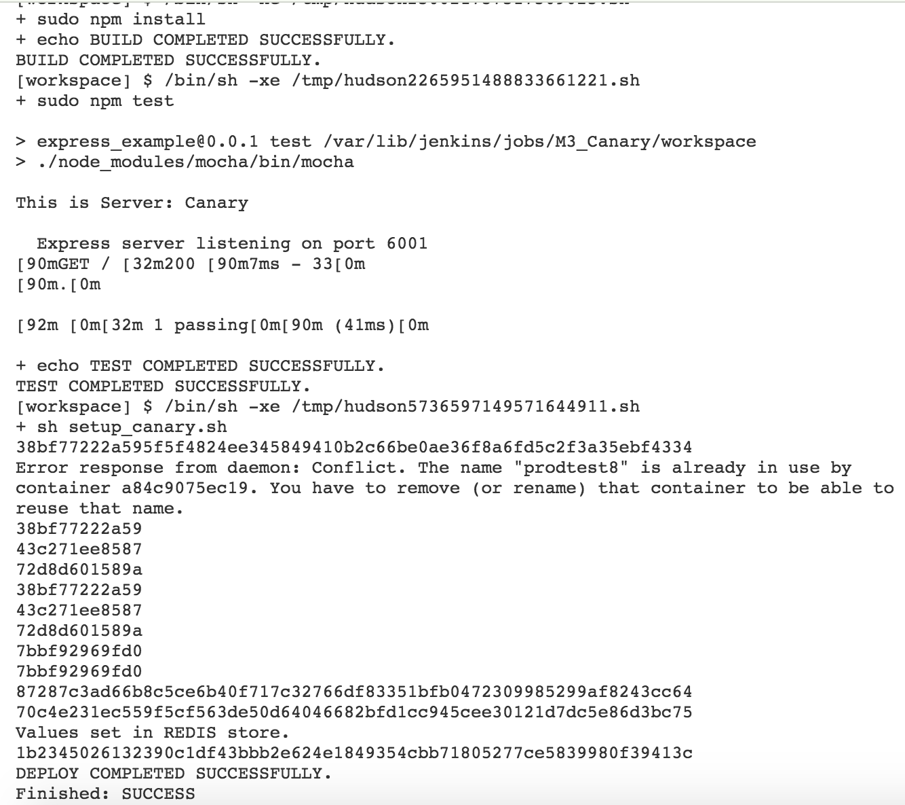

# CSC 591/791 DevOps, Fall 2015

## PROJECT MILESTONE #3 - Deployment

**TEAM:** 
*Kriti Bhandari - kbhanda*
*Rajashree Mandaogane - rsmandao*
*Ravina Dhruve - rrdhruve*

1. Automatic configuration of production environment
    Production environment is to be configured for two branches: Production (master) and Canary (dev).
    On a droplet, two docker containers, 'prodtest1' and 'prodtest2' are created and run. The script setup.sh starts and runs the docker containers when a git push is done to the Production branch. The script setup_canary.sh is for the configuration of Canary.
    
    The following commands are written in the jenkins job configuration for the Production job:
    ```
    sudo npm install
    echo "BUILD COMPLETED SUCCESSFULLY."
    sudo npm test
    echo "TEST COMPLETED SUCCESSFULLY."
    sh setup.sh
    echo "DEPLOY COMPLETED SUCCESSFULLY."
    ```
    
    The following commands are written in the jenkins job configuration for the Canary job:
    ```
    sudo npm install
    echo "BUILD COMPLETED SUCCESSFULLY."
    sudo npm test
    echo "TEST COMPLETED SUCCESSFULLY."
    sh setup_canary.sh
    echo "DEPLOY COMPLETED SUCCESSFULLY."
    ```


2. Triggered, remote deployment
    When git push is done to Production branch, after successful build and deploy (which can be checked on Jenkins Console Output), the docker containers are started and app is deployed on the containers.
    
    The deployed app can be accessed by going to 
    http://IP_address_of_jenkins:3000 and http://IP_address_of_jenkins:3001 in the browser.
    When git push is done to Canary branch, the docker container 'prodtest2' is started and app is deployed on the container.


3. Feature flags
    A redis-ambassador container is created. It is used to store the value of feature flags for each of the server instances. The redis container is the global redis store accessible by all the instances for feature flag as well as Proxy_server for load-balancing.

    Initially, we are setting feature flags for:
    ```
    Production branch:
        /: True and /about: False
    Canary(dev) branch:
        /: True and /about: True
    ```
    
    Note: Redis_ambassador is created in deployment stage and the setting up of feature flags is done by running nodejs redis_store.js which is a part of the deploy script - setup.sh and setup_canary.sh

    We can see that while accessing the respective features on browser, whenever /about request to Prod instance is made, the feature is off.

    On toggling the feature flag of /about to True for Production branch,
    the same request is then serviced.
    Note: To toggle the feature flag, we can change the values in the redis_store.js file.


4. Metrics & Alerts
    In order to monitor the deployed application on both Prod and Canary instances, two metrics are used:
    - CPU average usage
    - Memory Load
    
    Starting server.js on the proxy machine (here, a digital ocean droplet)
    ```
    nodejs server.js <email_address> <password>
    ```
    Note: email_address and password are provided in order to send email notification in case of alerts. You might have to check if access from less secure apps is on for this account or not.

    The server.js file starts the following:
    proxy_server : listening on port 8000 and monitoring_server
    
    The monitoring_server continuously measures the Prod and canary instances and raises an alert whenever Memory load & CPU usage metric crosses a pre-defined threshold.
    When the alert is raised, an email is sent using nodemailer over smtp as it has been shown in the screencast.

5. Canary Releasing
    The Proxy_server started by server.js performs the task of load-balancing the server requests between the Prod and Canary instances.
    
    It routes equal i.e 50% traffic to Prod instance with stable version of software and 50% traffic to Canary instance with newly staged version of software. This load-balancing is performed using the redis queue.

    As soon as the Canary instance becomes overloaded which is determined by the monitoring_server, an alert is raised and the Canary instance is removed from the queue. 
    The traffic is then routed only to the Prod instance running stable version of the application.


**SCREENCAST LINK: **

https://youtu.be/B7Jqhq1RwL0

Tool used: QuickTime Player
___


**File Description:**

+ README.md - this current file.
+ app.js - the main web server file.
+ redis_store.js - For setting the feature flags.
+ setup.sh - this file runs automatic configuration and deployment for Prod branch.
+ setup_canary.sh - this file runs automatic configuration and deployment for Canary (dev) branch.
+ server.js - the node.js file which starts proxy server and monitoring server code.


Try Droplet Migration workss RR


