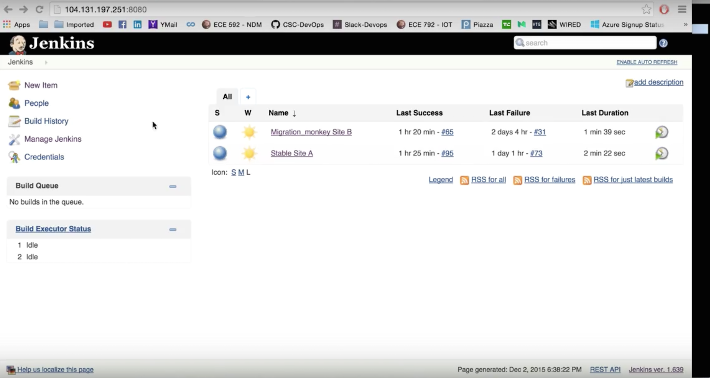

# CSC 591/791 DevOps, Fall 2015

## PROJECT MILESTONE #4 - SPECIAL MILESTONE - MIGRATION MONKEY

**TEAM:** 
*Kriti Bhandari - kbhanda*
*Rajashree Mandaogane - rsmandao*
*Ravina Dhruve - rrdhruve*


In this milestone, we are implementing a Migration monkey which brings up a new environment and 
migrates all the services to the new location.

####Environment setup:


+ Droplet 1 - runs Jenkins and HAProxy which monitors the health of the sites using a Heartbeat mechanism.
+ Droplet 2 - is the Stable Site A production to which requests are currently redirected to by the HAProxy.
              (Initially, running the Master Redis server)
+ Droplet 3 - is the Migration Site B production to which requests will be redirected post migration.
              (Initially on its start up, running the Slave Redis server)


####Jenkins Jobs:



On running the Migration_monkey Site B job, we will be configuring a new environment, deploying code
and services on it and will be starting those services in the most up-to-date state. Here, we are 
migrating the Redis server and Web servers from Site A to Site B.

Automatic configuration of site environments:
    The two jobs will be instantiated from the two branches in the repo as: M4test (for Stable Site A)
    and Migration (for Migration_monkey Site B).
    
    The following commands are written in the jenkins job configuration for the Stable Site A job:
    ```
    sudo npm install
    echo "BUILD COMPLETED SUCCESSFULLY."

    #sudo npm test
    echo "TEST COMPLETED SUCCESSFULLY."

    #DEPLOY
    sudo apt-get install sshpass
    sshpass -p 'redis_master' ssh -o StrictHostKeyChecking=no root@<Droplet2 IP> 'rm -rf DevOps_milestone3 && git clone -b M4test https://github.com/RavinaDhruve/DevOps_milestone3.git && cd DevOps_milestone3 && sh old_env.sh'

    #PRODUCTION COMPLETE
    #installing and starting haproxy with new haproxy.cfg from repo
    sudo apt-get remove haproxy -y
    sudo rm -rf /etc/haproxy

    sudo add-apt-repository ppa:vbernat/haproxy-1.5
    sudo apt-get update
    sudo apt-get dist-upgrade -y
    sudo apt-get install haproxy -y

    #haproxy.cfg file
    FILE='/etc/haproxy/haproxy.cfg'
     
    if [ -f $FILE ]
    then
       sudo mv /etc/haproxy/haproxy.cfg{,.original}
       sudo cp haproxy.cfg /etc/haproxy/haproxy.cfg
    else
       sudo cp haproxy.cfg /etc/haproxy/haproxy.cfg
    fi

    sudo service haproxy start
    ```
    
    The following commands are written in the jenkins job configuration for the Migration_monkey Site B job:
    ```
    sudo npm install
    echo "BUILD COMPLETED SUCCESSFULLY."

    #sudo npm test
    echo "TEST COMPLETED SUCCESSFULLY."

    #DEPLOY to new site
    sudo apt-get install sshpass
    sshpass -p 'redis_slave' ssh -o StrictHostKeyChecking=no root@<Droplet3 IP> 'rm -rf DevOps_milestone3 && git clone -b Migration https://github.com/RavinaDhruve/DevOps_milestone3.git && cd DevOps_milestone3 && sh new_env.sh'
    ```


####Migration Approach:
For doing Migration, we are using Master-slave approach along with Sentinel clusters for health checks and 
synchronization amongst the Redis servers.


###TASK 1: DEMONSTRATING MIGRATION

+ We do a Git push from Migration branch which will instantiate the Migration_Monkey Site B job.

+ Droplet 3 i.e Site B comes up. Since it runs the Slave Redis server, by means of Sentinel, it will synchronize
  itself according to Master Redis Server (on Site A) and will pull all the most up-to-date data.
  The Slave Redis server continuously maintains its database state by talking to the Master Redis.

+ We then bring down or purge Site A. The HAProxy realizes this and now starts redirecting all the user requests
  to the new migrated Site B.

+ The Slave Redis server at Site B now becomes the new master since there is no Master Redis in the sentinel now.

+ As demonstrated in the Screencast, the /set and /get operations show the most updated values of keys at Site B, 
  which were set by users when they were at Site A.

  **DATA MIGRATION IS SUCCESSFUL!!**


###TASK 2: EXTENSION OF SPECIAL MILESTONE

+ We have further extended the milestone to see what happens when Site A (with the old Master Redis server) comes up.

+ As demonstrated in the screencast, from the INFO command on redis-cli, we observe that the Site A redis server 
  has now become the slave of Site B redis server.

+ So, currently Site B runs the Master Redis server while Site A runs the Slave Redis server.

+ Now, if we purge Site B, the Site A will start running its Redis server back in the Master mode.

+ As demonstrated in the screencast, the browser requests now go to Site A again.

By means of this extension, we are showing continuous and consistent availability of servers in form of a cycle.


Note:
The deployed app can be accessed by going to http://IP_address_of_HAProxy:9000 in the browser.


**SCREENCAST LINK: **

https://www.youtube.com/watch?v=bqIkgmfw8CE

Tool used: QuickTime Player
___


**File Description:**

+ README.md - this current file.
+ app.js - the web server file.
+ haproxy.cfg - configuration file for HAProxy
+ old_env.sh - this file runs automatic configuration and deployment for the Site A Production environment.
+ new_env.sh - this file runs automatic configuration and deployment for the Site B Production environment.


